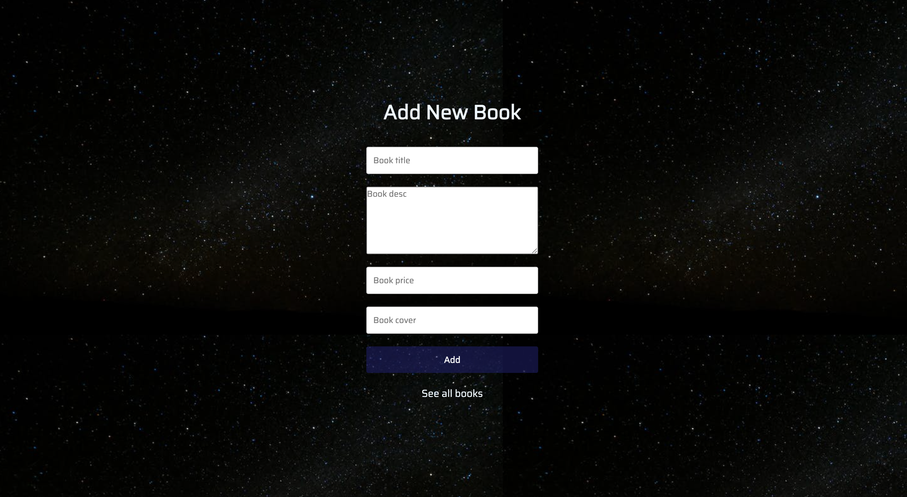
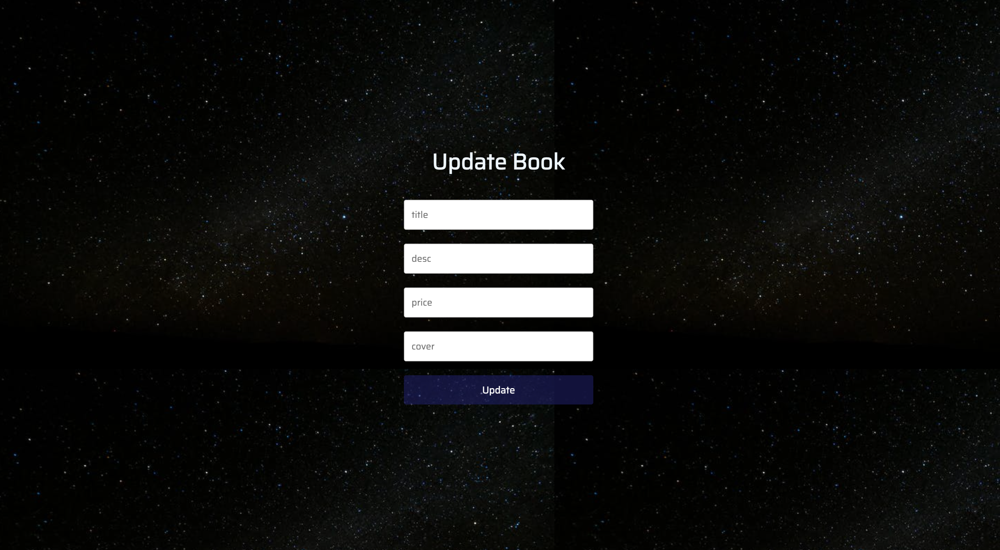

# My-Book-Shop

## Table of Content
* General Information
* Technologies Used
* Features
* Screenshot
* Installation and Setup Instructions
* Usage
* Project Status
* Room for Improvement
* Acknowledgements
* Contact

## General Information
I created this Book Shop that allows the user to view their book list, add new books to their list, and update said books. This project uses ReactJS, react-routing, react hooks such as: useState and useNavigation, NodeJS, MySQL, Cors, Nodemon, Express, Postman and CSS.

### Purpose of this project
To practice web design and routing.

## Technologies Used
* ReactJS
* React Router
* HTML
* CSS
* JavaScript
* NodeJS
* MySQL
* Cors
* Nodemon
* Postman
* Express

## Features
* React-routing.
* A Home page.
* An Add new book page => to access add: /add
* An Update books page => to access add: /update/:id
* Dynamic Add/Update/Delete buttons.

## Screenshot
Home Page 

Add Page 

Update Page

## Installation and Setup Instructions

Clone down this repository. You will need node and `npm` installed globally on your machine.

### Installation:

`npm install`

To Run Test Suite:

`npm test`

To Start Server:

`npm start`

To Visit App:

`localhost:3000/`

## Usage

**Home Page**

* Displays Book List

**URL Routing**

* To access all website pages look URL extensions in features.

**Dynamic Add New Book Button**

* Adds a new book to your book list.

**Dynamic Update Book Button**

* Allows the update of an existing book in the book list.

**Dynamic Delete Book Button**

* The delete book button will delete the book from the book list.

## Project Status
Project is: Completed

## Room for Improvement
* Add more UI elements

## Acknowledgements
* Many thanks to LamaDev.

## Contact
Created by Abeer Ahmed [LinkedIn profile](https://www.linkedin.com/in/abeerfrontend/) - feel free to contact me.

